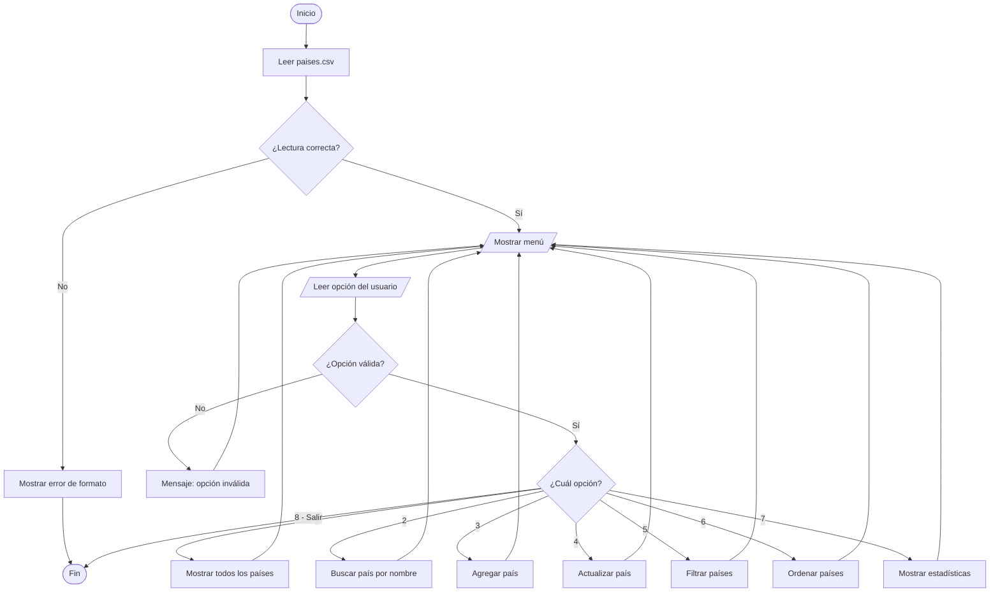
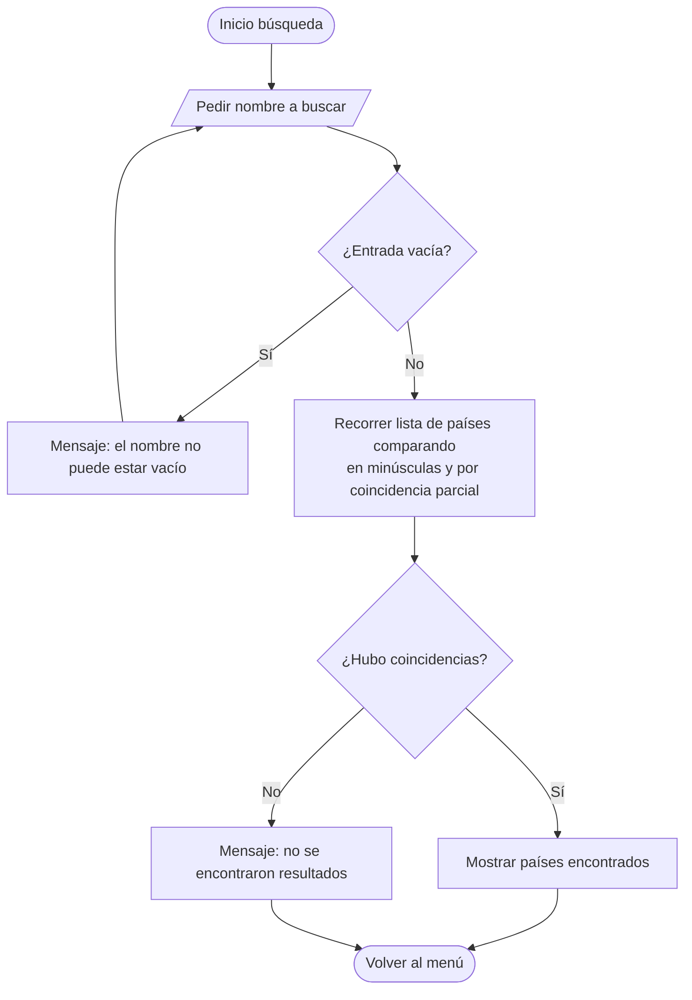
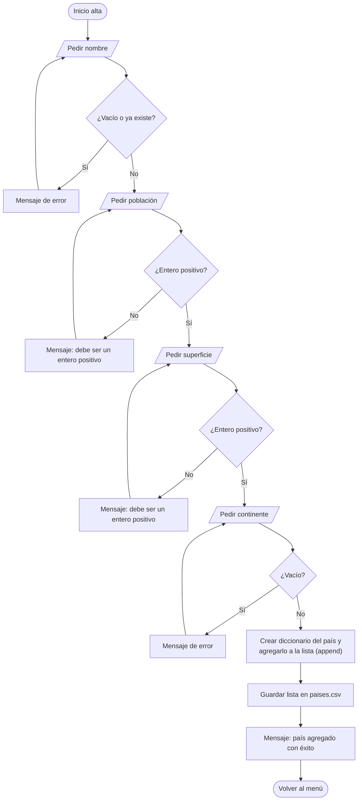
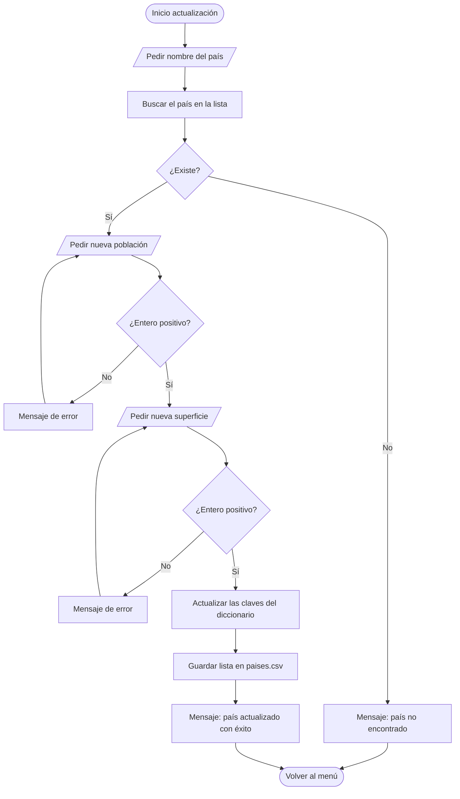
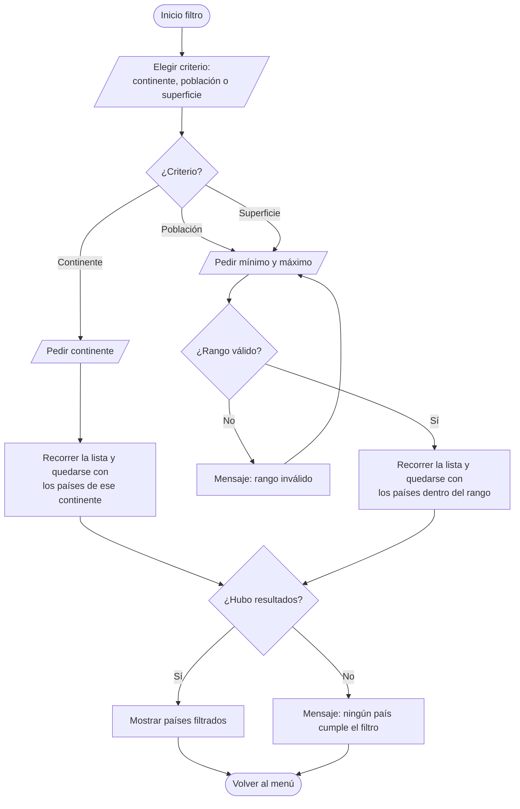
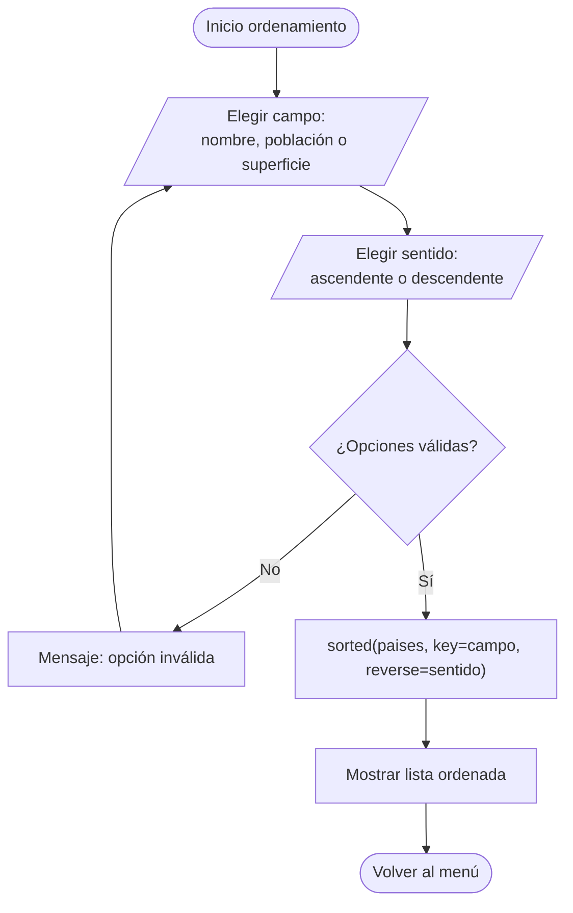
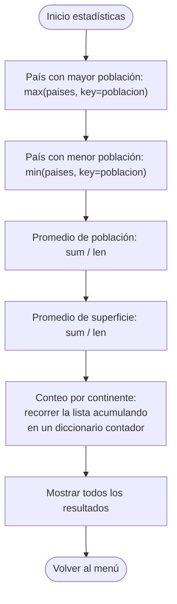

# Diagramas de flujo

Diagramas de las operaciones principales del programa, en formato
[Mermaid](https://mermaid.js.org/). GitHub los renderiza directamente; para el PDF
se pueden exportar como imagen desde https://mermaid.live.

## 1. Flujo general del programa (menú principal)

## 2. Buscar país por nombre

## 3. Agregar país (alta con validaciones)

## 4. Actualizar población y superficie de un país

## 5. Filtrar países

## 6. Ordenar países

## 7. Estadísticas

